# Image Inpaining 

## Dataset Description

For the purposes of the project, CelebA (CelebFaces Attributes) dataset was chosen. The computations were evaluated on 10'000 images from it.

- Link to the dataset and the article in which the image collection was used: [Dataset](https://paperswithcode.com/dataset/celeba)

- Dataset initial sample images: [Initial Images](https://github.com/Giminosk/Image-inpainting/tree/main/data/test/samples), e.g.:

  
  
  

 

In order to perform image inpainting, it was needed to add artifacts to further inpaint it and augument later on.

- Dataset masked sample images: [Masked Images](https://github.com/Giminosk/Image-inpainting/tree/main/data/test/samples_masked), e.g.:

  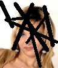
  
  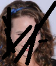

## Problem Description

The goal of image inpainting problem in computer vision is to fill in missing or corrupted parts of an image with plausible content. This can be used to restore damaged photographs or remove unwanted objects from an image. In our case, the "gaps" were filled in for the described dataset.

## Description of used architectures

**Note:** The hyperparameters' values ***(Dropout, Optimizer)*** were chosen by using Tuning. The tensorboard events of it can be found here: [Tuning](tensorboard/)

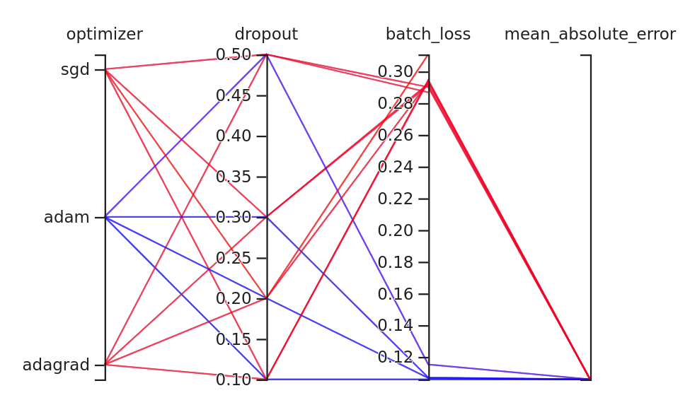

### Description of used metrics, loss, and evaluation (common for all architectures)

**Hyperparameters:**

- Dropout = 0.2 (tuned on 0.1, 0.2, 0.3, 0.4 rates)

- Optimizer = 'adam' (tuned on 'adam', 'sgd', 'adagrad' options)

**Metrics:**

- [Dice Coefficient](https://en.wikipedia.org/wiki/S%C3%B8rensen%E2%80%93Dice_coefficient)

- [Jaccard Distance](https://en.wikipedia.org/wiki/Jaccard_index)

- [Cosine Similarity](https://en.wikipedia.org/wiki/Cosine_similarity)

**Loss functions:**

- Mean absolute error - [MAE](https://en.wikipedia.org/wiki/Mean_absolute_error)

- Structural similarity - [SSIM](https://en.wikipedia.org/wiki/Structural_similarity)

- Peak signal-to-noise ratio - [PSNR](https://en.wikipedia.org/wiki/Peak_signal-to-noise_ratio) 

The best results were obtained using ***SSIM*** loss function. Therefore, it was used for all further computations.

### Architecture 1 - Simple Autoencoder

#### Model Architecture

Model Architecture diagram can be found here, since the images are too large to display: [Autoencoder Architecture Diagram](images/autoencoder/autoencoder.png)

#### Model Analysis

- Size in memory: 37.0MB

- Number of parameters: 2,942,019

- Training time: 

#### Plots - Training, Loss functions

  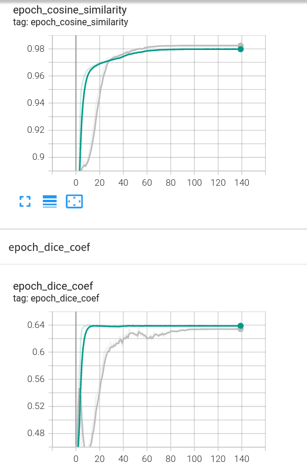
  

As it can be seen, used EarlyStopping callback function stopped on 140 epochs. The plots above show the smooth nature of the training: metrics values increase, loss values decrease, both converge.

### Architecture 2 - Autoencoder with Skip Connections

#### Model Architecture

Model Architecture diagram can be found here, since the images are too large to display: [Autoencoder-Skip-Connections Architecture Diagram](images/autoencoder_skip/autoencoder_skip.png)

#### Model Analysis

- Size in memory: 87.0MB

- Number of parameters: 7,053,123

- Training time: 

#### Plots - Training, Loss functions

  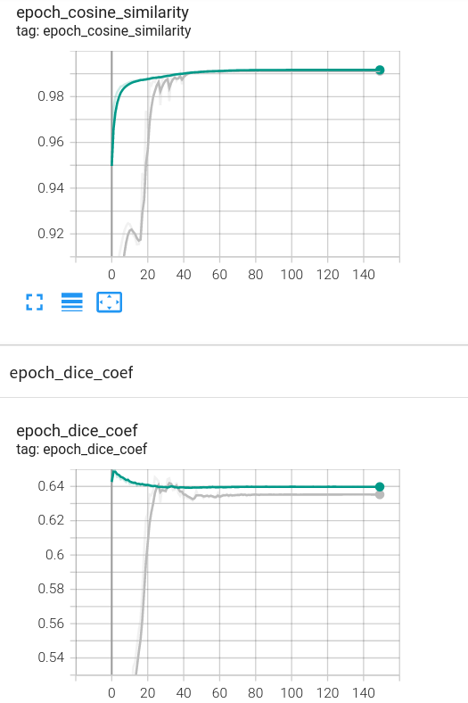
  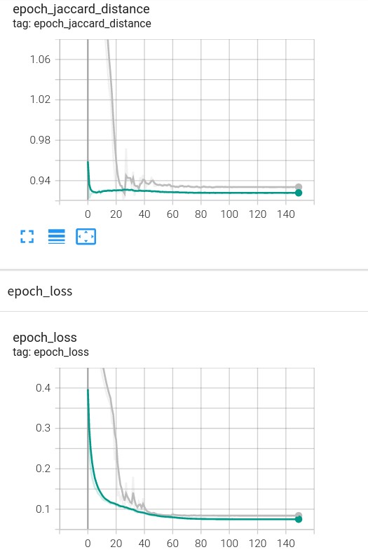

As it can be seen, used EarlyStopping callback function stopped a bit later than 140 epochs. However, loss values are smaller than in case of simple Autoencoder.

### Architecture 3 - GAN

#### Model Architecture

Model Architecture diagram can be found here, since the images are too large to display: [GAN Discriminator Architecture Diagram](images/gan/discriminator.png) and [GAN Generator Architecture Diagram](images/gan/generator.png)

#### Model Analysis

- Size in memory: 100.0MB

- Number of parameters: 10,200,228

- Training time: 

#### Plots - Training, Loss functions

  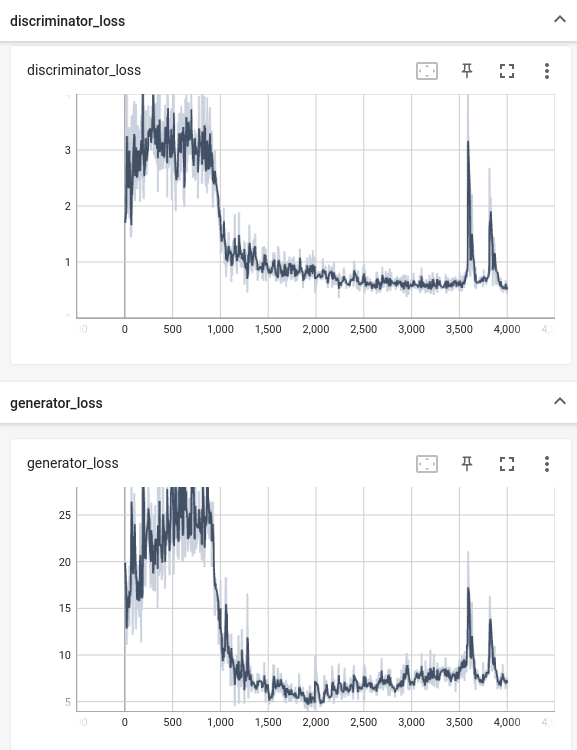
  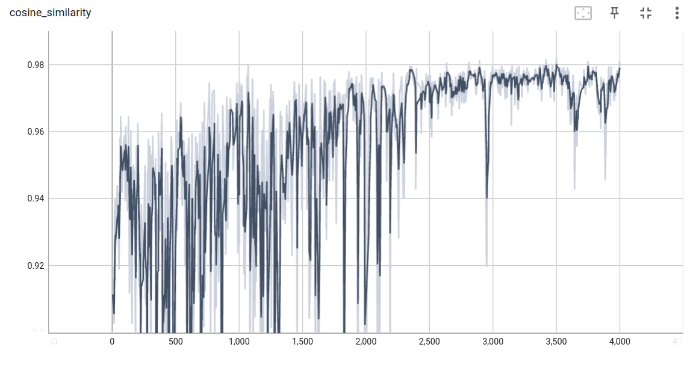

**Remark:** the training was performed ***not*** on the full dataset. Therefore, the results are compromised by that.

A great raggedness can be seen on the plots above. It took the algorithm 4'000 to converge, and still the discriminator did not manage to "win" generator. When it comes to loss function, it stabilizes only by approximately 2'500 epoch.

## Model Comparison and Results

### Autoencoder

  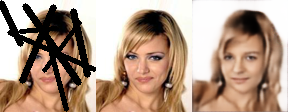
  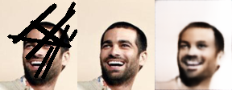
  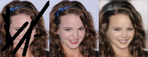

### Autoencoder with Skip Connections

  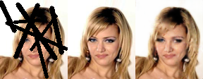
  
  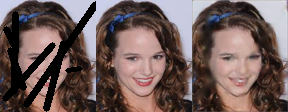

### GAN

  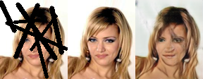
  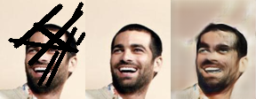
  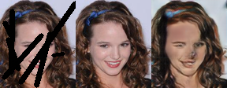

## Tools

- Runtime Environment: `Google Colab`

- Libraries: `numpy, matplotlib, PIL, cv2, imgaug, tensorflow, tensorboard`

## References

- [Articles that worked with CelebA Dataset](https://paperswithcode.com/dataset/celeba)

- [Dice Coefficient](https://en.wikipedia.org/wiki/S%C3%B8rensen%E2%80%93Dice_coefficient)

- [Jaccard Distance](https://en.wikipedia.org/wiki/Jaccard_index)

- [Cosine Similarity](https://en.wikipedia.org/wiki/Cosine_similarity)

- [Mean absolute error](https://en.wikipedia.org/wiki/Mean_absolute_error)

- [Structural similarity](https://en.wikipedia.org/wiki/Structural_similarity)

- [Peak signal-to-noise ratio](https://en.wikipedia.org/wiki/Peak_signal-to-noise_ratio) 

- [Autoencoder Explained](https://neptune.ai/blog/representation-learning-with-autoencoder)

- [Skip Connections Explained](https://towardsdatascience.com/using-skip-connections-to-enhance-denoising-autoencoder-algorithms-849e049c0ac9)

- [GAN Explained](https://developers.google.com/machine-learning/gan/gan_structure)

