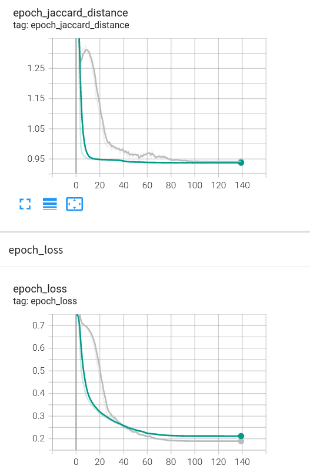

# Image Inpaining 

## Dataset Description

For the purposes of the project, CelebA (CelebFaces Attributes) dataset was chosen.

- Link to the dataset and the article in which the image collection was used: [Dataset](https://paperswithcode.com/dataset/celeba)

- Dataset initial sample images: [Initial Images](https://github.com/Giminosk/Image-inpainting/tree/main/data/test/samples), e.g.:

  
  
  

 

In order to perform image inpainting, it was needed to add artifacts to further inpaint it.

- Dataset masked sample images: [Masked Images](https://github.com/Giminosk/Image-inpainting/tree/main/data/test/samples_masked), e.g.:

  
  
  

## Problem Description

The goal of image inpainting problem in computer vision is to fill in missing or corrupted parts of an image with plausible content. This can be used to restore damaged photographs or remove unwanted objects from an image. In our case, the "gaps" were filled in for the described dataset.

## Description of used architectures

**Note:** The hyperparameters' values ***(Dropout, Optimizer)*** were chosen by using Tuning. The tensorboard events of it can be found here: [Tuning](tensorboard/)

## Description of used metrics, loss, and evaluation (common for all architectures)

**Hyperparameters:**

- Dropout (tuned on 0.1, 0.2, 0.3, 0.4 rates)

- Optimizer (tuned on 'adam', 'sgd', 'adagrad' options)

**Metrics:**

- [Dice Coefficient](https://en.wikipedia.org/wiki/S%C3%B8rensen%E2%80%93Dice_coefficient)

- [Jaccard Distance](https://en.wikipedia.org/wiki/Jaccard_index)

- [Cosine Similarity](https://en.wikipedia.org/wiki/Cosine_similarity)

**Loss functions:**

- Mean absolute error [MAE](https://en.wikipedia.org/wiki/Mean_absolute_error)

- Structural similarity [SSIM](https://en.wikipedia.org/wiki/Structural_similarity)

- Peak signal-to-noise ratio [PSNR](https://en.wikipedia.org/wiki/Peak_signal-to-noise_ratio) 

The best results were obtained using ***PSNR*** loss function. Therefore, it was used for all further computations.

### Architecture 1 - Simple Autoencoder

#### Model Architecture

Model Architecture diagram can be found here, since the images are too large to display: [Autoencoder Architecture Diagram](images/autoencoder/autoencoder.png)

#### Model Analysis

- Size in memory: 37.0 MB

- Number of parameters: 2,942,019

#### Training Description

#### Plots - Loss functions and Hyperparameters

  
  
  

